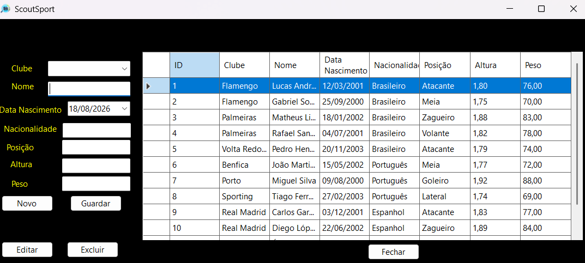
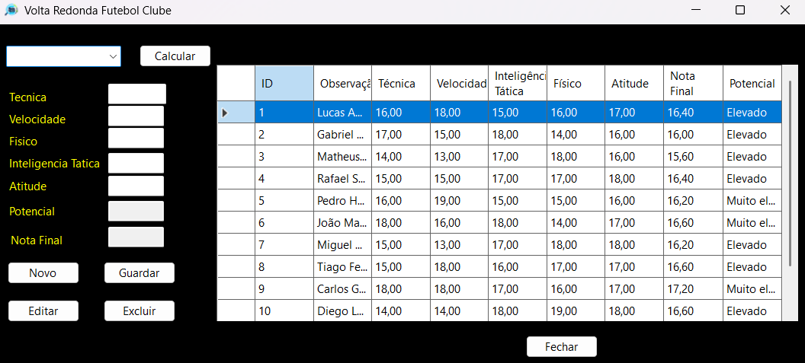
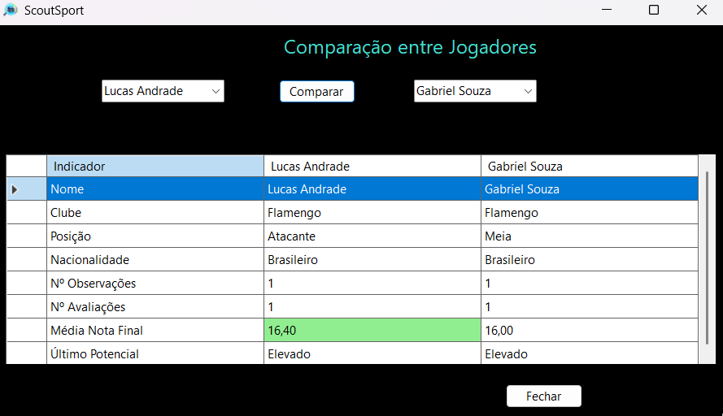

# ScoutSport

Sistema desenvolvido em C# para gestão e avaliação de jogadores de futebol.

O ScoutSport foi criado com o objetivo de apoiar o processo de scouting, permitindo organizar clubes, jogadores, observações e avaliações técnicas de atletas.

## Tecnologias

- C#
- .NET 10
- Windows Forms
- Entity Framework Core
- SQL Server
- LINQ
- Git / GitHub

## Funcionalidades

- Cadastro e gestão de clubes
- Cadastro e gestão de jogadores
- Registo de observações
- Avaliação de jogadores
- Cálculo automático da nota final
- Classificação de potencial
- Histórico de avaliações
- Comparação entre jogadores

## Estrutura principal

O projeto utiliza as seguintes entidades:

- Clube
- Jogador
- Observacao
- Avaliacao

Principais relações:

- Um clube pode possuir vários jogadores
- Um jogador pode possuir várias observações
- Uma observação pode possuir uma avaliação

## Base de Dados

A aplicação utiliza SQL Server através do Entity Framework Core.

A connection string não é armazenada diretamente no código-fonte.

Para configurar uma base local, utilize User Secrets:

```powershell
dotnet user-secrets init
```

Depois configure a connection string:

```powershell
dotnet user-secrets set "ConnectionStrings:ScoutSportDb" "SUA_CONNECTION_STRING"
```

Exemplo utilizando SQL Server LocalDB:

```text
Server=(localdb)\MSSQLLocalDB;Database=ScoutSportDb;Trusted_Connection=True;TrustServerCertificate=True;
```

## Como executar

Clone o repositório:

```bash
git clone https://github.com/matheuscguedes/ScoutSport.git
```

Entre na pasta do projeto:

```bash
cd ScoutSport
```

Restaure as dependências:

```bash
dotnet restore
```

Execute a aplicação:

```bash
dotnet run
```

## Screenshots

### Tela principal


### Gestão de jogadores



### Avaliação de jogador



### Comparação entre jogadores



## Evolução do Projeto

O ScoutSport foi inicialmente desenvolvido como aplicação desktop utilizando Windows Forms.

O projeto encontra-se em evolução para uma versão web utilizando ASP.NET Core MVC, com o objetivo de melhorar a arquitetura, a interface e aprofundar conhecimentos no ecossistema .NET.

## Autor

**Matheus Calmeto Guedes**

Junior .NET Developer

- LinkedIn: linkedin.com/in/matheus-calmeto-guedes
- GitHub: github.com/matheuscguedes